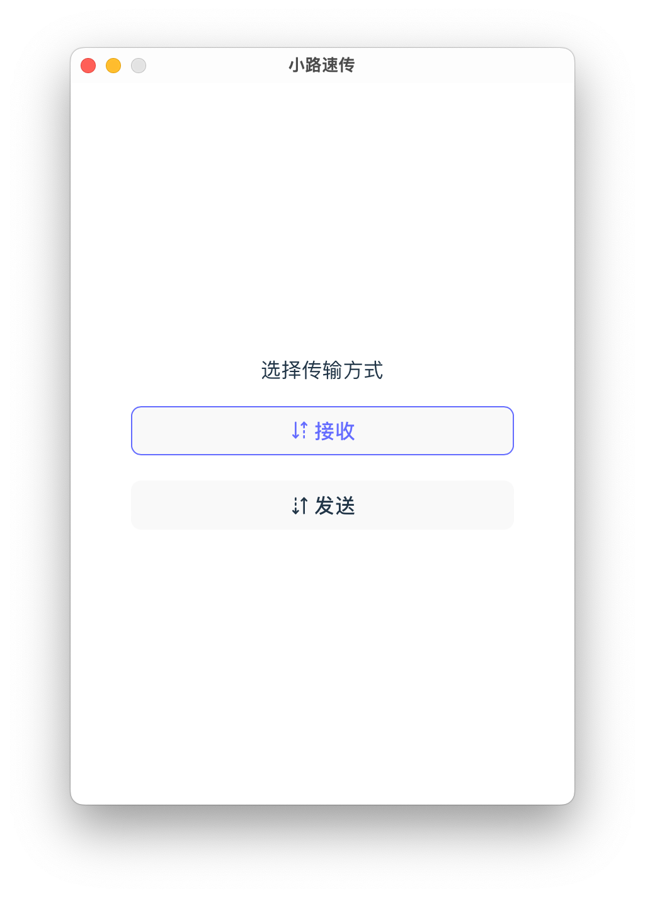
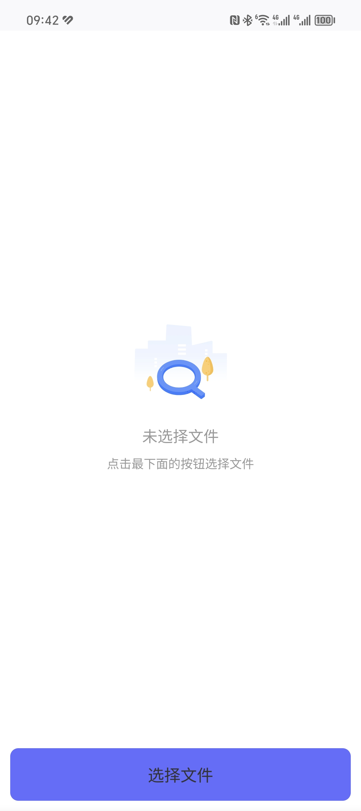
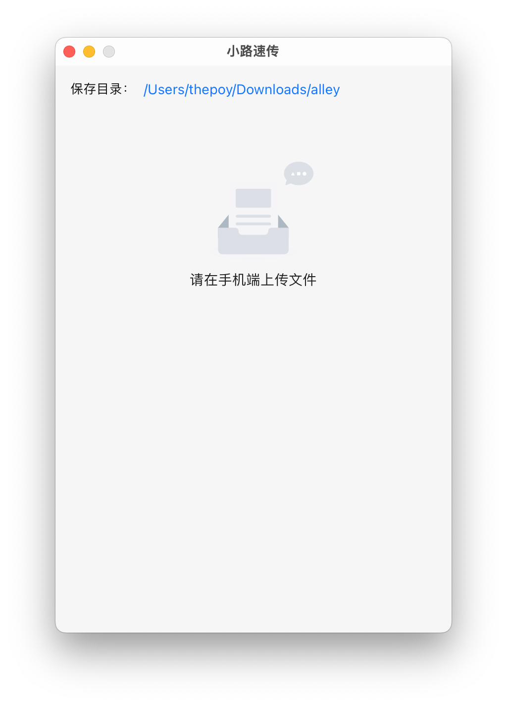
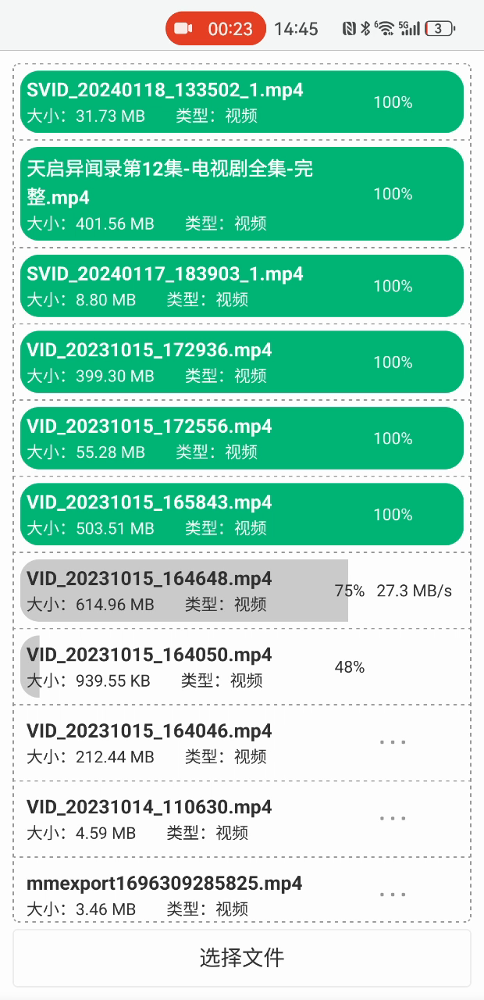
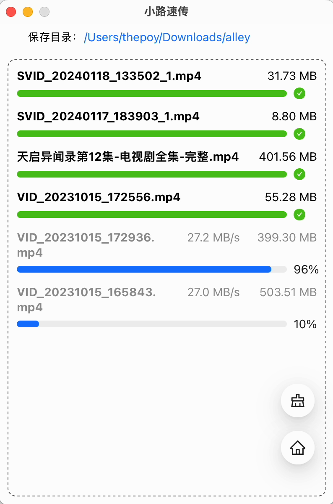
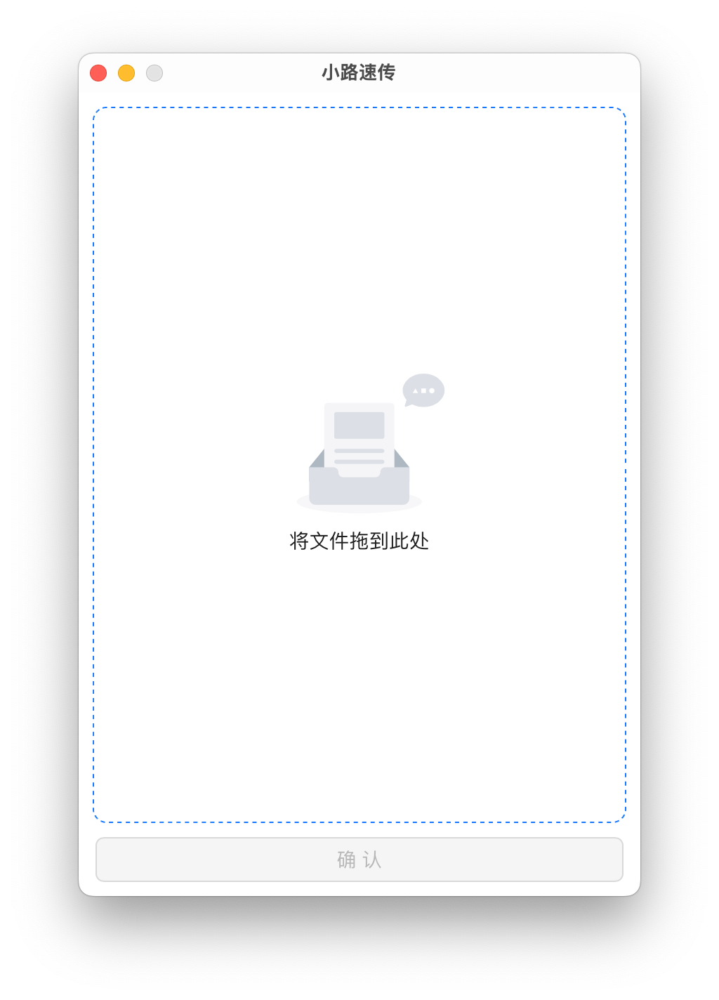
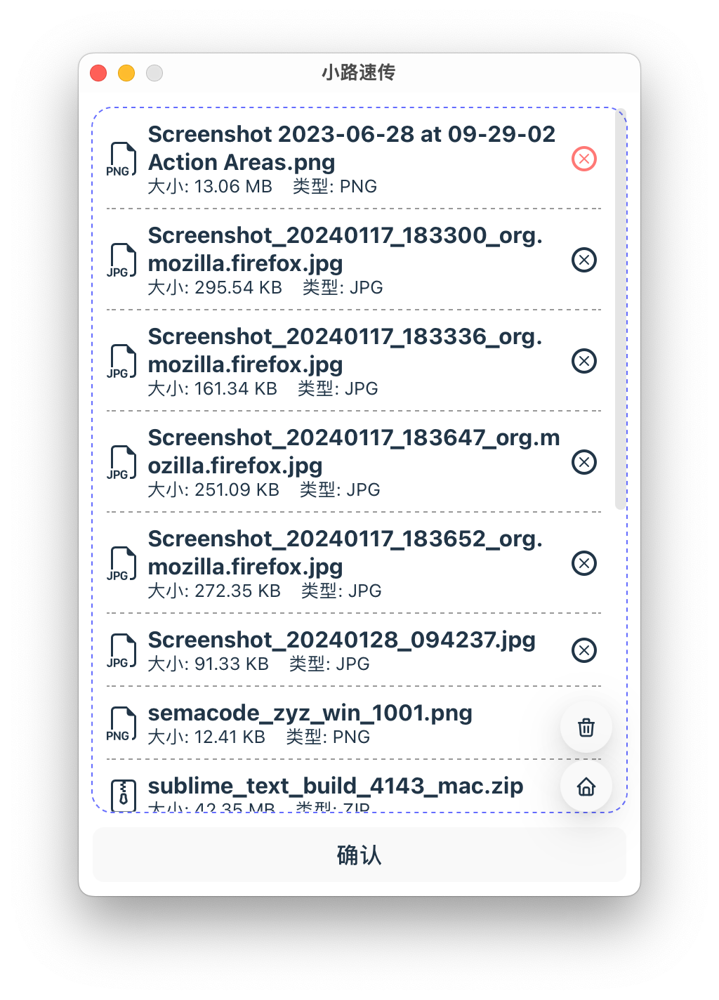
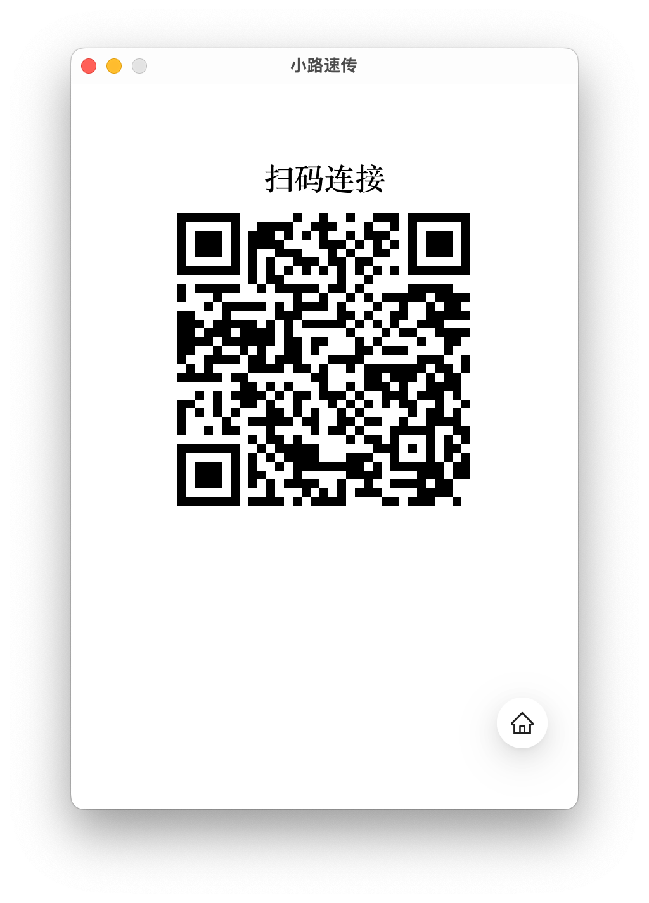
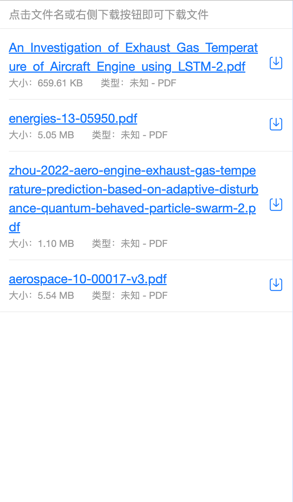

 English | [简体中文](./README.zh-CN.md)

# ALLEY

ALLEY is a tool for quickly transferring files between terminals on the same local network segment. It is compatible with Windows, macOS, and Linux desktop distributions, providing a convenient and comfortable experience for users who frequently transfer files between their phones and computers.

Before the development of the mobile version, users could only upload and receive files through the mobile browser. For a better upload experience, it is recommended to use [Edge](https://play.google.com/store/search?q=edge&c=apps), [Chrome](https://play.google.com/store/search?q=Chrome&c=apps), [Firefox](https://play.google.com/store/apps/details?id=org.mozilla.firefox), or [QQ Browser](https://browser.qq.com/mobile).

## Features

This software may have distinctive features compared to other similar software:

- Open source

- Small footprint

  | Platform and Format                      | Size (v0.1.0-alpha.7) |
  | ---------------------------------------- | --------------------- |
  | macOS aarch64 - dmg                      | 4.29 MB               |
  | Linux (Debian/Ubuntu/Deepin) amd64 - deb | 6.45 MB               |
  | Windows amd64 - msi                      | 4.29 MB               |
  | Windows amd64 - exe                      | 4.07 MB               |

- Ugly interface (lack of design talent)

## Usage

After opening the software, you need to select the transfer mode:

### Receive Mode

After selecting the receive mode, a QR code will appear. Scanning the QR code with your phone will open a page in the default browser, and the PC-side page will also change.

On the phone, click the `Select Files` button at the bottom of the page to upload multiple files. At the same time, the PC side can see the progress of receiving files.

> Click on the image to view a larger version.

| Before PC Scan                              | Mobile Side                                    | After PC Scan                                 | Mobile Upload                                 | PC Side Receive                           |
| ------------------------------------------- | ---------------------------------------------- | --------------------------------------------- | --------------------------------------------- | ----------------------------------------- |
|  |  |  |  |  |

The default save path for files received on the PC side for all platforms is `~/Downloads/alley`. You can modify the save directory yourself.

### Send Mode

After selecting the send mode, you can drag the files to be sent into the software window through the file manager. After clicking the confirm button, a QR code will appear. Scanning it with the phone will open the file list sent by the PC side, and clicking on the file name will save the file to the phone.

_Due to limitations of the mobile operating system, mobile browsers cannot achieve batch downloading, only individual downloads._

> Click on the image to view a larger version.

| PC Side Files to Be Sent                    | PC Side File List to Send             | PC Side Send QR Code                     | Mobile Side Receive Page                          |
| ------------------------------------------- | ------------------------------------- | ---------------------------------------- | ------------------------------------------------- |
|  |  |  |  |
