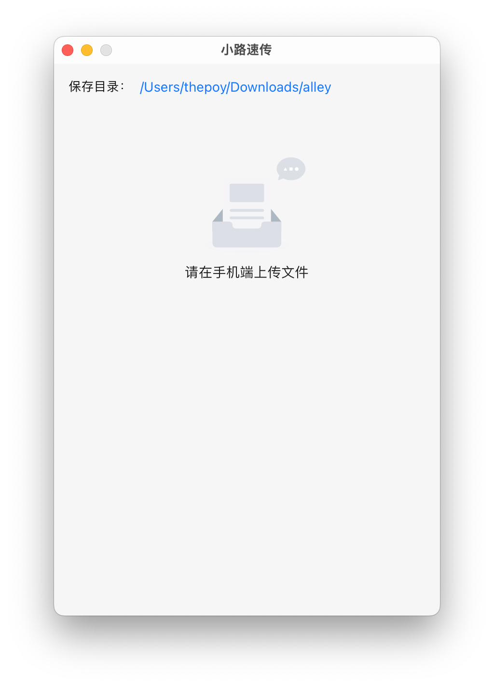

# ALLEY

在局域网中使用手机快速向 PC 传递文件的工具，适配 Windows、macOS 和 Linux 桌面发行版。

在未开发手机端前，只能通过手机浏览器上传文件，建议使用 [Edge](https://play.google.com/store/search?q=edge&c=apps)、[Chrome](https://play.google.com/store/search?q=Chrome&c=apps) 、[Firefox](https://play.google.com/store/apps/details?id=org.mozilla.firefox) 或 [QQ浏览器](https://browser.qq.com/mobile)。

## 特点

本软件可能有别于其他同功能软件的特点有：

- 开源

- 体积小

  | 平台及格式                              | 体积    |
  | --------------------------------------- | ------- |
  | macOS aarch64 - dmg                     | 4.24 MB |
  | Linux(Debian/Ubuntu/Deepin) amd64 - deb | 6.2 MB  |
  | Windows amd64 - msi                     | 4.03 MB |
  | Windows amd64 - exe                     | 3.26 MB |

- 页面丑（缺少设计天份）

## 使用

打开 PC 端后有一个二维码，使用手机扫描二维码会通过默认浏览器打开一个页面，同时 PC 端的页面也会变化。

| PC 端扫描前                         | 手机端                                    | PC 端扫描后                        |
| ----------------------------------- | ----------------------------------------- | ---------------------------------- |
|  |  |  |

在手机上点击页面中间的`upload`按钮即可上传多个文件，同时 PC 端也能看到收取文件的进度。

| 手机端上传                                    | PC端接收                                  |
| --------------------------------------------- | ----------------------------------------- |
|  |  |

所有平台的 PC 端接收到的文件默认保存路径均为`~/Downloads/alley`，你可以自行修改保存目录。
